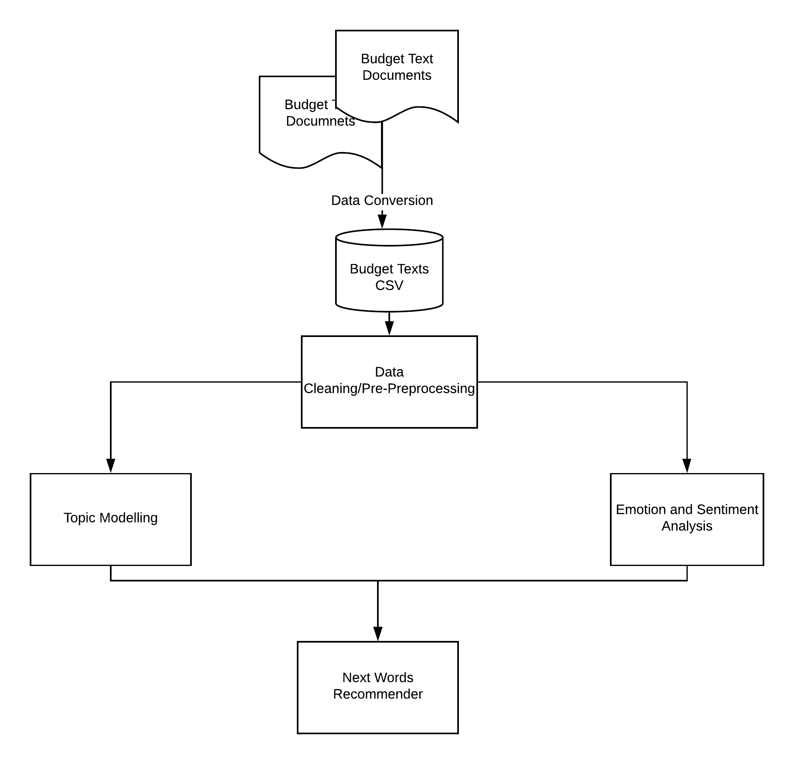

# Budget Text Analysis

Budget documents from different local governments are collected, preprocessed and analyzed to draw up conclusions that may help Guilford County to better organize their budget documents and enable them to make better budget decisions for the future.

## Table of contents
* [Introduction](#introduction)
* [Technologies](#technologies)
* [Data Source](#data-source)
* [Goals](#goals)
* [Contributors](#contributors)
* [Team Tasks](#team-tasks)

## Introduction

Text analysis has been defined as the automated process that allows machines to extract and classify information from text. Businesses might use text analysis to extract specific information such as keywords, names, and organization information. Businesses may also categorize text with tags according to topic, point of view or classify them as positive or negative. In this project our goal is to preform textual analysis on seven budget documents from different counties and cities across the state of North Carolina. By applying advanced text analysis methods, such as Topic Modelling and Sentiment Analysis, our team is hoping to extract meaningful information. In addition, the team is aiming to build a text generation tool that may assist Guilford County with the production of their budget documents.

## Technologies
  * Python v3.7
  * Anaconda v3.4.3
  * Numpy v1.8.2
  * Pandas v0.25.1

## Data Source
The data is obtained from the following organizations as PDF files and then converted into csv files

   * [Guilford County](https://www.guilfordcountync.gov/home/showdocument?id=9497)
   * [Durham County](https://www.dconc.gov/home/showdocument?id=27985)
   * [City of Durham](https://durhamnc.gov/DocumentCenter/View/27412/FY20-Final-Budget)
   * [City of Charlotte](https://charlottenc.gov/budget/FY2020%20Documents/FY%202020%20Adopted%20Budget%20Book%207-31%20Complete.pdf)
   * [Mecklenburg County](https://www.mecknc.gov/CountyManagersOffice/OMB/Documents/FY2020%20Adopted%20Budget.pdf)  
   * [Wake County](http://www.wakegov.com/budget/fy20/Documents/FY20%20Adopted%20Budget%20Book.pdf)
   * [City of Raleigh](https://user-2081353526.cld.bz/FY2020AdoptedBudget)

## Goals
   * Understand the budget text data and analyze its scope.
   * Use topic modelling techniques to discover abstract topics.
   * Use NLP methods such as sentiment analysis to extract subjective information.
   * Leverage Machine Learning to find similarities between the budget documents.
   * Develop a text generation  tool.
   
## Contributors
   * Team Members:
       * [Naseeb Thapaliya](https://github.com/naseebth)
       * [Akash Meghani](https://github.com/AkashMeghani)
       * [Unnati khivasara](https://github.com/Unnati20)
       * [Sultan Al Bogami](https://github.com/AlbogamiSultan)
       * [Miguel Gaspar](https://github.com/mdgaspar20)

   * Instructor:
       * [Dr. Somya Mohanty](https://github.com/somyamohanty)
   * Mentor:
       * [Mr. Jason Jones](https://www.linkedin.com/in/jones-jason-adam/)

## Team Tasks

   1. Data Collection: Sultan Al Bogami and Akash Meghani
   
   2. Data Pre-Processing: Everyone
   
   3. Exploratory Text Analysis: Sultan Al Bogami

   4. Statstical Text Analysis:

       * Original: Naseeb Thapaliya, Miguel Gaspar and Sultan Al Bogami
       * Sentiment: Akash Meghani, and Unnati Khivasara
       
   5. Machine Learning:
   
       * Sentiment Analysis: Akash Meghani, and Unnati Khivasara
       * Topic Modeling: Naseeb Thapaliya and Miguel Gaspar
       * Corpus Similarity: Sultan Al Bogami
       
   6. Next Word Recommender (optional): Everyone
   
   7. Evaluation: Everyone
   
   8. Deployment: Everyone
